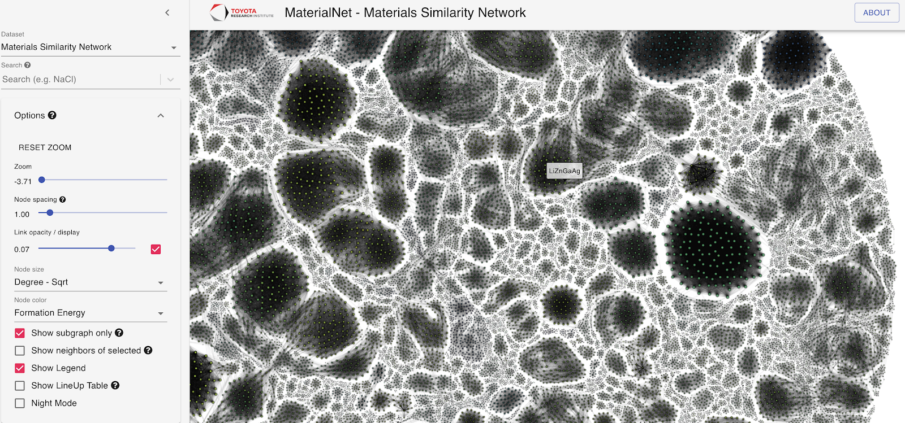
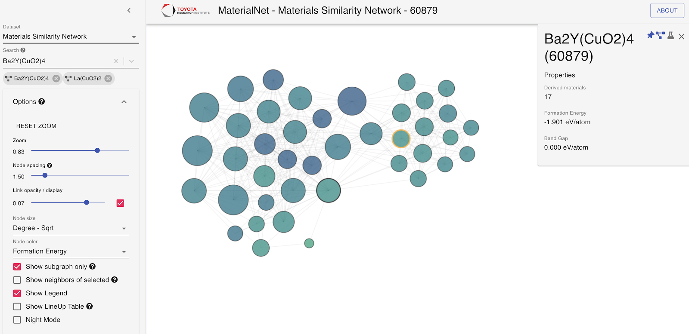
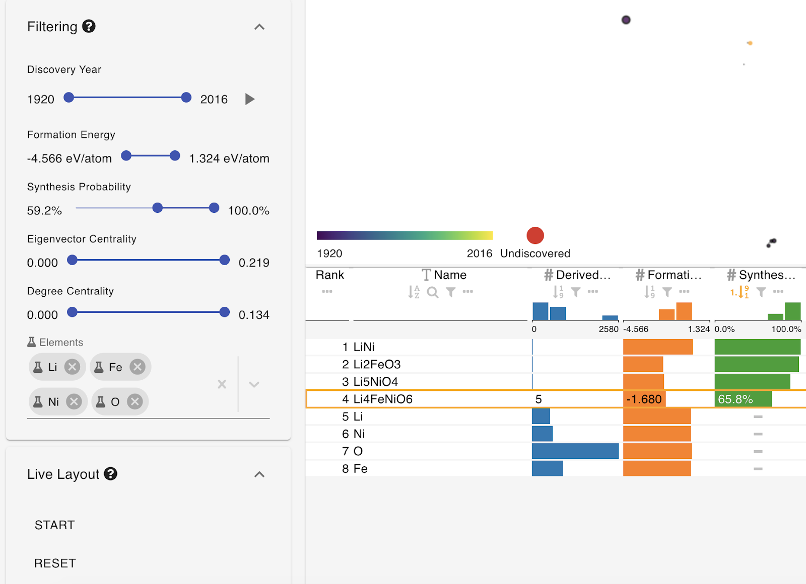
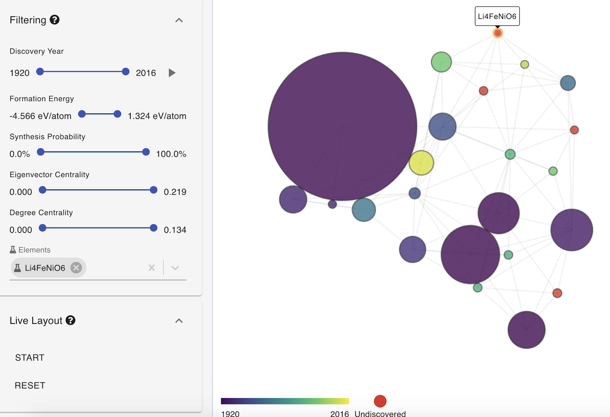

# MaterialNet

Try it live: https://maps.matr.io

MaterialNet is a visual exploration tool to explore large networks in the
context of material science.

In the past five years, materials databases have become very popular because
they enable their users to do rapid prototyping by searching near globally for
figures of merit for their target application. However, both scientists and
engineers have little in the way of visualization of aggregates from these
databases, i.e. intuitive layouts that help understand which materials are
related and how they are related. The need for a tool that does this is
particularly crucial in materials science because properties like phase
stability and crystal structure similarity are themselves functions of a
material dataset, rather than of individual materials.

MaterialNet provides for this by enabling a simple layout of a given network of
materials. The examples in the current implementation are for the aforementioned
cases (i.e. visualization of the "complete" phase diagram of the OQMD and
similarity metrics from crystal structure), but the tool may be applied to any
case in which a materials network can be constructed.

The most obvious extensions of this that we envision are users with their own
database of formation energies which may differ from the OQMD. Similarly, any
vector representing material properties can be used to construct a similarity
network, a user might want to understand how the network of materials with
similar optical properties differs from that of materials with similar
mechanical properties.

## Setup

1. Install the project dependencies:

    ```
    yarn install
    ```

2. Move into the public assets directory:

    ```
    cd public
    ```
    
3. Download the public sample data:

    ```
    curl -O -J https://data.kitware.com/api/v1/item/5e5696b4af2e2eed35da2e42/download
    ```
    
    (Alternatively, you can visit the cloud folder where this file is stored at
    https://data.kitware.com/#collection/5e569610af2e2eed35da2e0b/folder/5e5696acaf2e2eed35da2e33
    and download the file manually.)
    
4. Unpackage the sample data:

    ```
    tar xzvf sample-data.tar.gz
    ```

    After this step, there will be a `public/sample-data` directory with
    contents like this:

    ```
    stability.json
    similarity.json
    control.json
    structures/
    ```
    
5. Build and serve the application:

    ```
    BROWSER=none yarn start
    ```

6. Launch the application: visit http://localhost:3000 in your browser, and wait
   a few moments for the initial dataset to load (the data is pretty big, so
   this could take up to 10 seconds).

## Interactions

* Use the `mouse wheel` to zoom into the map
* Use `ctrl + mouse wheel` to change the node spacing factor
* `Clicking` on a node will select it, clicking on the same node again will deselect it
* `ctrl + click` on a node to select and pin it

## Example Usage

We expect researchers to use MaterialNet both as an exploratory tool to traverse
the present materials networks, and as a targeted analysis tool when they can
leverage the underlying relational information for a scientific goal directly.
Below we provide example use cases for each.

### Similarity Network

Since the similarity network relates materials on the basis of their structural
and chemical resemblance (which may not always be obvious), it is interesting to
explore for a curious materials scientist, traversing the nodes as one
neighboring material inspires another. For instance, take the famous
superconductor, YBCO, a version of which can be located by searching for
Ba2Y(CuO2)4. We can pin this material using the "pin" icon and choose to
restrict our view to its immediate neighborhood by clicking on the "show
neighbors" icon. Optimizing the layout with “Live Layout” moves the remaining
nodes closer and provides a compact view of this local environment. We can
explore the first degree neighborhood of YBCO - and keep pinning more materials
to venture out to second or third degree similarity neighborhoods. We find other
interesting cuprates, and may stumble on other potential superconductors that we
may not be aware of. We can do similar explorations starting off of thousands of
other materials, e.g. the well-known magnetocaloric compound Gd5(SiGe)2.

 

### Stability Network

The Materials Stability Network is temporal, and is constructed on the basis of
a thermodynamic measure explained in an application on synthesis likelihood
prediction (https://doi.org/10.1038/s41467-019-10030-5). A researcher interested
in finding a new, cost-effective hypothetical (quite likely synthesizable!)
candidate for a Li-ion battery material can start by filtering the network down
to materials containing relevant elements of their choice (say Li, Fe, Ni and O)
using the Filtering option. They can adjust the synthesis probability to focus
on hypothetical materials with, for instance, greater than roughly 60% chance of
being made. Using the LineUp Table, they can sort the results based on this
probability. If they choose a material from the list to inspect further, such as
Li4FeNiO6, they can select it by clicking on its row in the table or node in the
network. They can focus attention to the local network environment of this
selected material by using the three icons that appear in the material details
to “pin”, “show neighbors” and “restrict subspace” to the relevant chemistry.
The element filters can be cleared, and synthesis probability slider can be set
back to its original position to visualize this relevant sub-network for
Li4FeNiO6, and further optimizing the layout with “Live Layout” option can
provide a more organized, compact view. This material’s connectivity to hub-like
materials (like O, Fe, Li, Fe2O3, Li2O, etc.), less common known materials or
other hypothetical materials can be inspected to provide guidance for a
synthesis attempt, potential competing phases or decomposition products
(https://doi.org/10.1038/s41467-019-10030-5).

 

## Internal Notes

### How to add a managed property to the mobx state?

Every property of the ApplicationState class (see ./src/store/index.js) annotated with the `@observable` annotation will be automatically tracked. This can be a primitive value, array or object.

In addition, the components itself has to observe the injected store using the `@observer` annotation.

Example component with proper store injection:

```js
import React from 'react';
import Store from '../../store';
import { observer } from 'mobx-react';

// marks that the component should be rerendered as soon as an used observable property of the store has changed
@observer
class Template extends React.Component {
  // see https://reactjs.org/docs/context.html to inject the store into this component
  static contextType = Store;

  render() {
    // access the context as defined by the `contextType`
    const store = this.context;

    // just access or change the value
    return <div onClick={() => { store.year = 2005; }}>
      Hello {store.year}
    </div>;
  }
}

export default Template;
```

Besides regular properties, derived/computed properties are used. Just define a property with a getter function that uses other obserable properties. Annotate with `@computed` and mobx will cache and reevaluate the property when needed.


### What is autorun?

`autorun` is similar to registering an observer. The given function will be observed for changes and reevaluated when needed.

e.g.
```js
autorun(() => {
  console.log(store.year);
});
```

each time the `store.year` changes, a log statement will be created.
